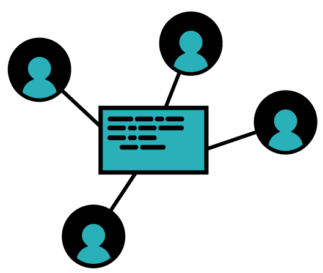
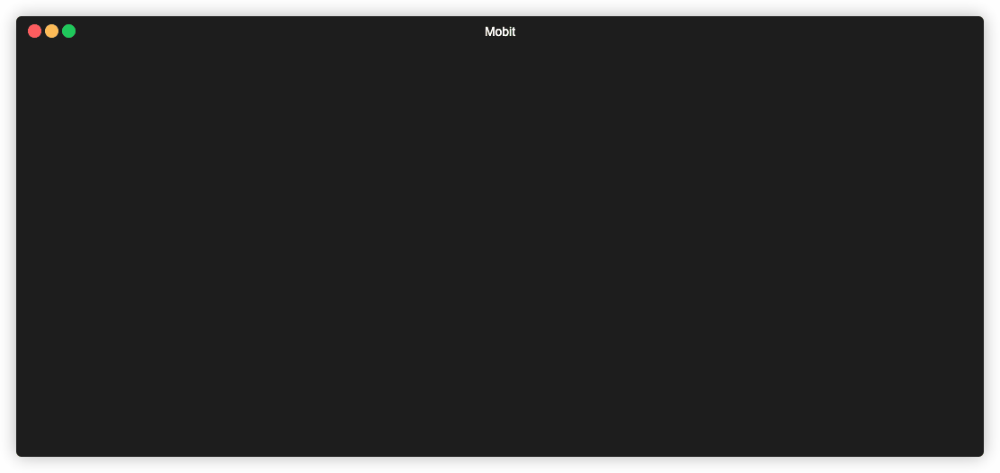

   

# Mobit (Alpha)
**Note that this is an early release and is incompete and prone to bugs. Please create an issue for any problems you encounter**

## What is it 
An interactive cli tool build in node to help the git handover when mobbing remotely. 

The app listens for changes in config that will determine who is driving or navigating, and terminal will update when chages are detected.

    

## Still to do 
- Impliment mob completion - squash commits onto main branch and delete mob config
- Impliment break functionality - would be good to broadcast to everyone that the break is happening and anyone can stop it
- Fix all @todos
- Add custom base branch and commit message to config
- Make debug and silent modes and create commands for each task
- Refactor and fix test coverage 
- More testing on all scenarios
- Add auto publishing with symantic versioning

## Installation
`npm install -g mobit`

`yarn global add mobit`

Alternatively clone the repo and `yarn link`

## How it works
When you run the tool it will ask for information about the mob session (if not already provided). When you start mobbing you will be either in a driver or navigator mode. Note that you will need to keep the cli running to receive updates.

### Driving
Timer begins, once the timer is up you have the following options
- Handover: Pass to the next person, all work is committed and pushed to the wip branch (with --no-verify).
- Finish: Complete the mob, squash wip commits and atage changes on the main branch
- Break: todo all mob members will be have a countdown untill the break ends
- Exit: Do nothing and exit to main menu

### Navigating
App listens for changes in the config, if its your turn your timer will start.

### Configuration 
Local config (mob branch/base branch/commit message) are stored on your machine and added via the cli menu. 

Mob config is temporarily stored in the repo as a json file while mobbing. Ths contains info about the mob:
- Members of the mob
- Duration 
- Break duration
- Number of rotations before a break

## Alternatives 
- https://github.com/remotemobprogramming/mob - Great tool that heavily inspired this one

